# R Configuration


Below is a description of our R environment.

```{r}
sessionInfo()
```

# Accessing Our "Dirty" Data From data.world


The data we used contains information about all of the higher education institutions in the United States from 2003 to 2013. It includes number of undergraduates, demographics, location, and average ACT and SAT data of matriculants.

The "dirty" version of our data can be accessed from data.world using the following R script.

```{r}
source("../01_Data/data.world.R")
summary(df)
```

# Cleaning Up Our Data


To make our data easier to understand and work with, we created the following ETL (extract-translate-load) script to edit our CSV file containing higher education institution data using the steps below. 

1. After cloning our repo, we set our working directory to the "00_Doc" folder.

2. We then downloaded and saved our dataset from data.world to the "01_Data" folder. We renamed the file to "PreETL_merged_university_data", and created a file path leading to this file so that it could be read into RStudio as a data frame. (See the next section for instructions on how to download data files from data.world)

3. We looked through the data set and determined that the column names needed to be more descriptive. So we looked up what each of the variable names represented and renamed the variables so that they would be more descriptive. We did this by using the rename function from the plyr package. 

4. For consistency, we decided to alter the zip codes so that all zip codes would only contain 5 digits. We did this by using the substring function.

5. Lastly, we changed all of the "NULL" values to read "NA in order to be more user friendly. This was accomplished by using the lapply and gsub functions. 

6. We saved a copy of our "clean" CSV file by removing "PreETL_" from its name, and uploaded our clean dataset back to data.world.

The code used to accomplish these steps can be found in detail in the following R script. Below is a sample of our "clean" CSV file.

```{r}
source("../01_Data/ETL.Final.R")
summary(df)
```

# Downloading Our "Clean" Data from data.world


Once we cleaned up our data, we uploaded a new copy of it to data.world. To import this csv file for use in Tableau:

1. On the Tableau homescreen, under "To a Server" click "Web Data Connector" on the left-hand Connect menu. 

2. For the URL, type "https://tableau.data.world" and press Enter. 

3. For the Dataset, type "mamilloy/s-17-dv-project-6". 

4. Copy your personal data.world API Token into the next field and click "Get Dataset".

5. All csv files in the above dataset will appear on the left-hand side of the screen to be used. 

# Visualizations Using Crosstabs


In Tableau, we created a crosstabs visualization to analyze possible relationships between year and state. Specifically in this visual, we looked at the ratio of in-state tuition to total graduate students across the states. First, two data sets from our data.world profile needed to be joined. The university data had the number of graduate students and the 2010 Data_Update2 sheet had the in-state tuition information for each state. We completed an inner join on state of these two data sets in order to get the in-state tuition and total undergraduate students for each state. Across the x-axis of the cross tabs in year and along the y-axis is state. In each of the cells is the total number of undergraduates for that year and state. The KPI is the in-state tuition over the total number of undergraduates. The table is colored by KPI: the cells in orange are the low KPI, red is medium KPI, and blue is high KPI. This visual is interesting because it can be seen how the tuition for in-state students can be broken down across the average university population in that state. It really shows how high in-state tuition can be.

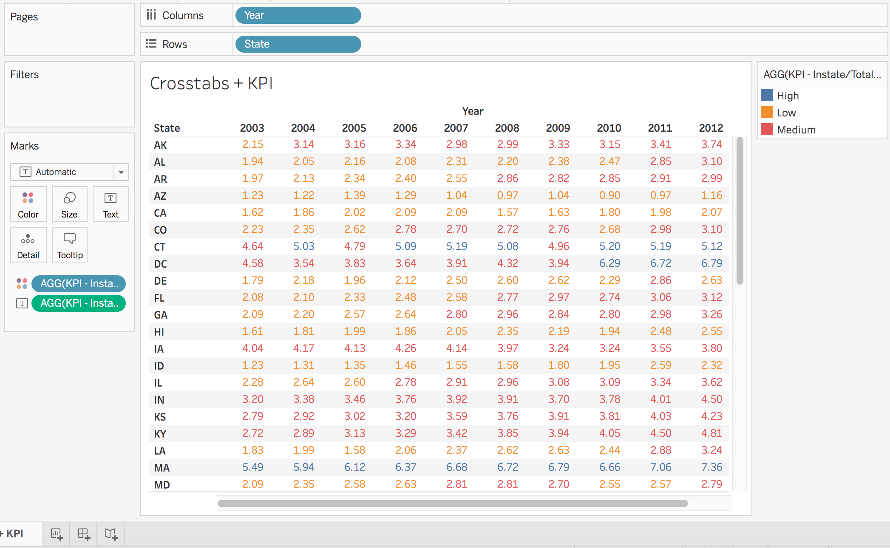

The shiny app was also created to mimic the Tableau visual. In order to join the data via the server.R, a SQL query was written that joined the two datasets, calculated the KPI, and separated KPI values into low, medium, and high. The KPI was calculated was the same as in the Tableau visual. The range values for low, medium, and high were set in the ui.R code to match the values set in Tableau.

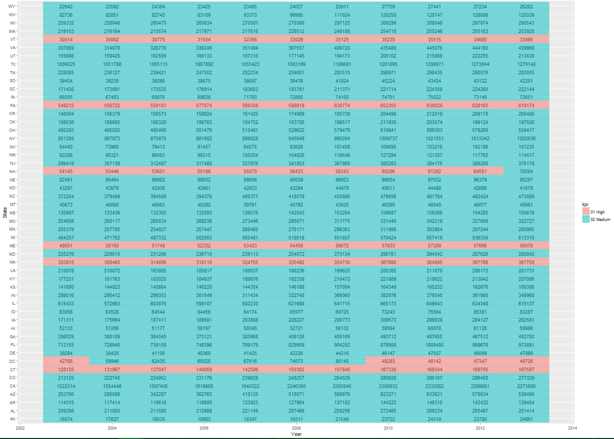

# Visualizations Using Barcharts


This first barchart displays the percentage of people working toward a bachelors degree per U.S. state. To create this plot, two datasets were connected using an inner join on each of the states. The first dataset, acsInfo, contained the number of bachelors students per state, and the second dataset, censusdata, containted each state's total population. Both of these datasets were obtained from the U.S. Census Bureau's 2010 census data. A calculated field was created to determine the percentage of those studying toward a bachelors degree in each state by dividing bachelors students by state population. Plotting states on the X axis and the calculated field on the Y axis created the final barchart. An average line was used to show where the average percentage of bachelors students falls across all states, which was 12.603%. 

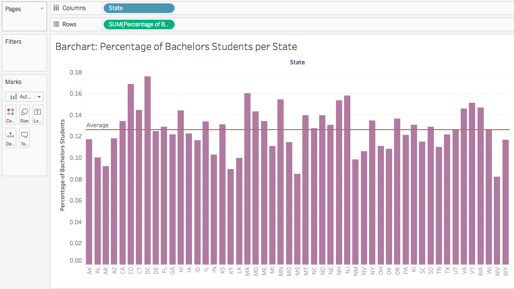

The above Tableau barchart was also created in Shiny by using ggplot. This Shiny app also displays the percentage of people working toward a bachelors degree in each U.S. state. This plot also contains an average line showing the average percentage of bachelors students across all states, with it's value displayed in the side panel to the left of the barchart.

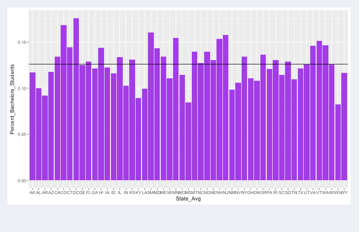

This next graph depicts the average percentage of students of each demographic category across all the institutions in each US state and territory. Demographic categories include White, Black, Hispanic, Asian, and other. The data is displayed as a stacked bar graph and was retrieved from "Clean_merged_university_data.csv". In Tableau, this plot was made by dragging "State" into Rows and dragging the measure values for each demographic into Columns. To make this graph in Shiny, the plotly package was used to make a stacked bar graph. Using this package also offers the benefits of interactivity when hovering over columns.

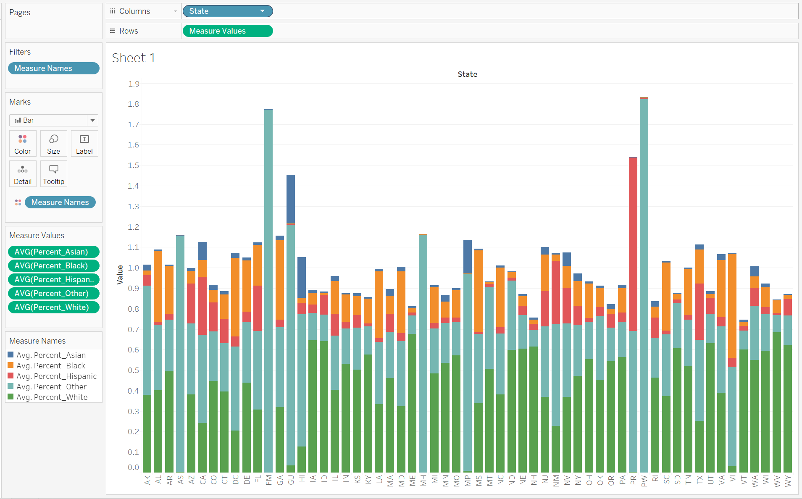
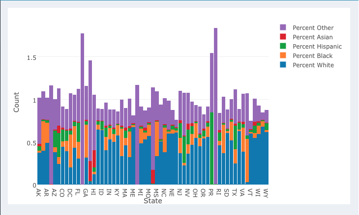

# Visualizations Using Histograms


The following histogram was created in Tableau to show how many institutions fall within a certain range of in-state tuition on a yearly basis. The X axis represents bins in increments of $5000 for in-state tuition, and the Y axis represents the number of institutions that fall within each bin. Pages were also added to this visualization such that it could be observed how the number of schools within each bin changes from year to year. As tuition prices increased each year, a visible shift could be seen towards the right of the graph, and the 2003 graph's right skew became less noticeable. 

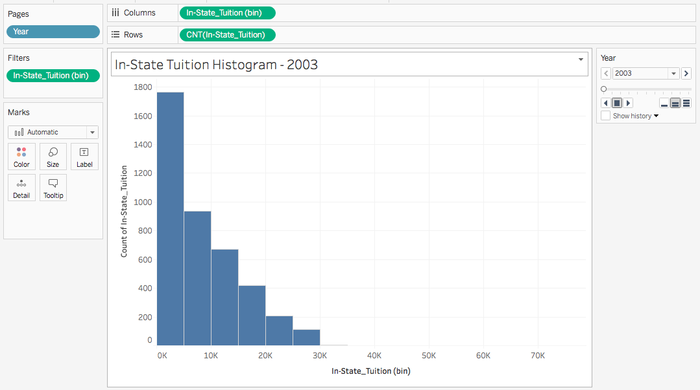

A similar histogram was also created in Shiny using ggplot and plotly. This histogram also shows how many instututions fall within a certain range of in-state tuition prices, but this histogram includes all data from 2003 to 2013. Hovering over each bin in the app will display each bin's count. This histogram also includes a reference line representing the average in-state tuition price across all institutions. 

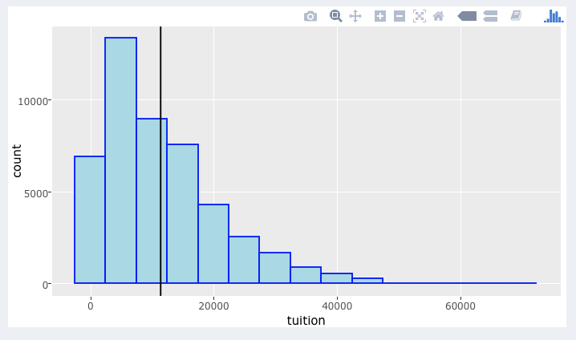

# Visualizations Using Scatterplots


This scatterplot tests the correlation of obesity to education level across all 50 states using the R packages ggplot and Shiny.  The plot displays the percentages of obese people per U.S. state against the number of state citizens possessing a college degree over total state population.  The plot reveals a very clear negative correlation between education level and obesity rate by state and is emphasized by the addition of a regression line.  The data was amassed from 3 data.world tables that were double joined to make the needed query. The Shiny code (server.R and ui.R) allows for easy sharing of the visualization and the plotly R package imparts hovering functionality to make the graphic more interactive.

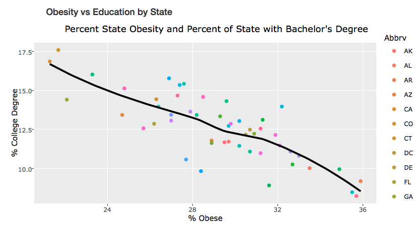

This Tableau graphic recapitulates the scatterplot correlating state obesity rate to education level.  The data for the plot was collected via a web SQL query utilizing a double INNER JOIN (see associated image below) allowing the construction of  the two measures: prcntObesity against the calculated field(100*(bachelors/population)). The plot was then filtered on state and a trend-line was added. As mentioned previously, a negative association is observed between state education level and obesity rate.

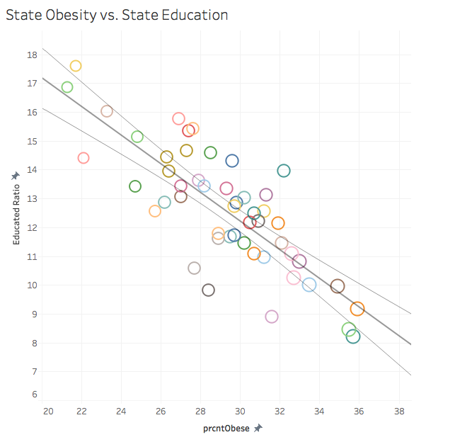

To build the above scatterplot, a web connection to our data.world repository was established and a double INNER JOIN between the adult_obese, censusdata and acsinfo tables was made that joined on the state variable. It is a graphical representation of the following SQL query: 
SELECT O.prcntObese, C.State_Population, O.Abbrv, A.bachelors, A.State FROM adult_obese as O 
JOIN censusdata as C on O.Abbrv = C.State_Avg 
JOIN acsInfo as A on A.State = O.Abbrv;

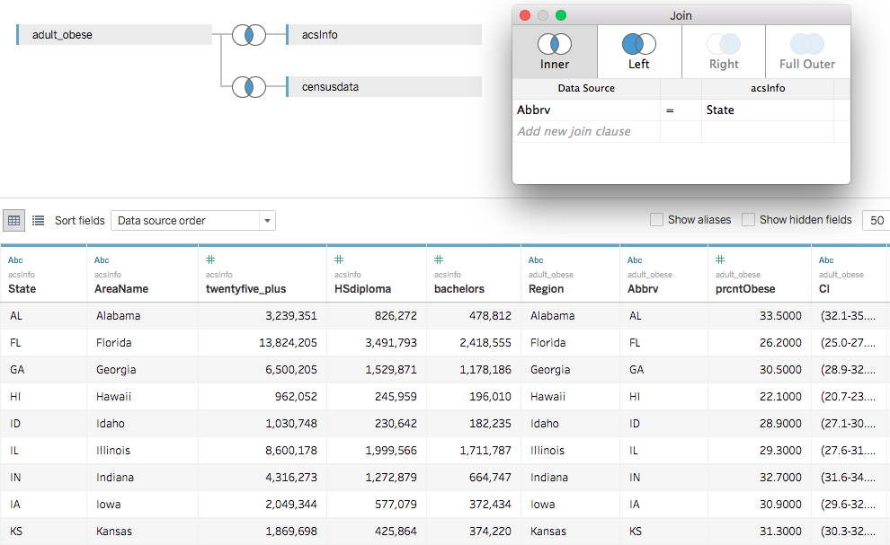

Using Shiny Actions, we also created a series of scatterplots displaying the average undergraduate SAT score for U.S.universities and grouped them together into categories based on what U.S. state or territitory the school is located . Each state runs along the X axis, and scores run along the Y axis. The scatterplot is also color coded by state with a legend to the right of the plot. Each university is represented by a single point, and each state's average SAT score is represented by a black diamond. By clicking and dragging a selection box across a subset of the points in the scatterplot, a new scatterplot is created that displays only those points selected. This visualization was generated with the ggplot2 R package using its geom_point() and stat_summary() functions.

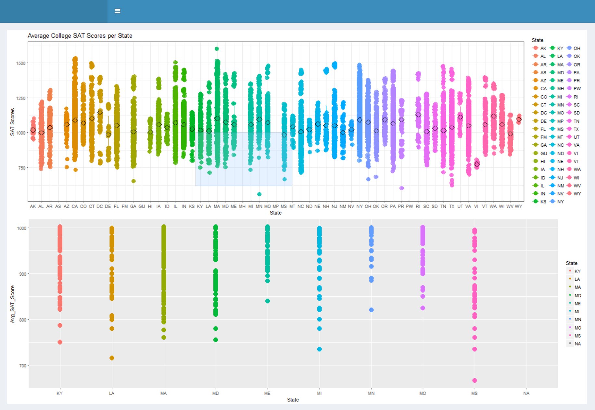

# Visualizations Using Boxplots

This is a box plot that displays the average SAT scores for each school broken down by state. It was created using data from the ‘Clean-Merged-University” data set. We got the data on tableau from using the web connector and connecting through data.world. For the shiny app, we ran a query through data.world. This graphic is interesting because you can see how SAT scores vary across states. In tableau this graphic was created by putting state onto the Columns section, and Average SAT Score onto the rows section. Year was dragged onto color to see which year each score came from. In shiny, it was created using the plot and geom_boxplot functions. 

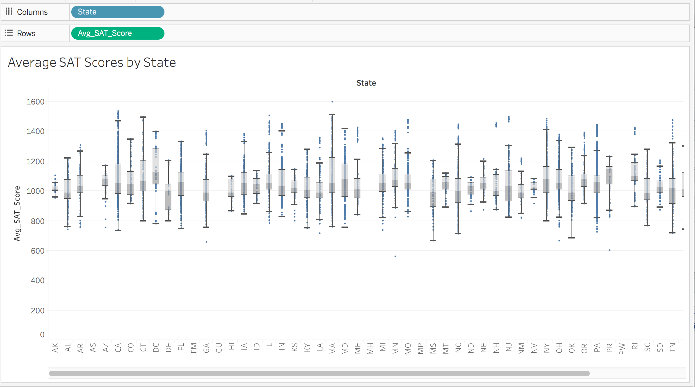
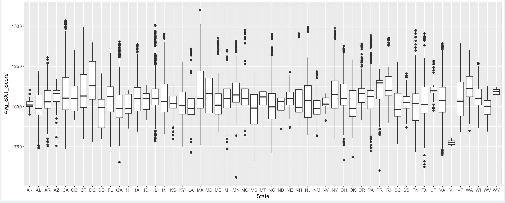
